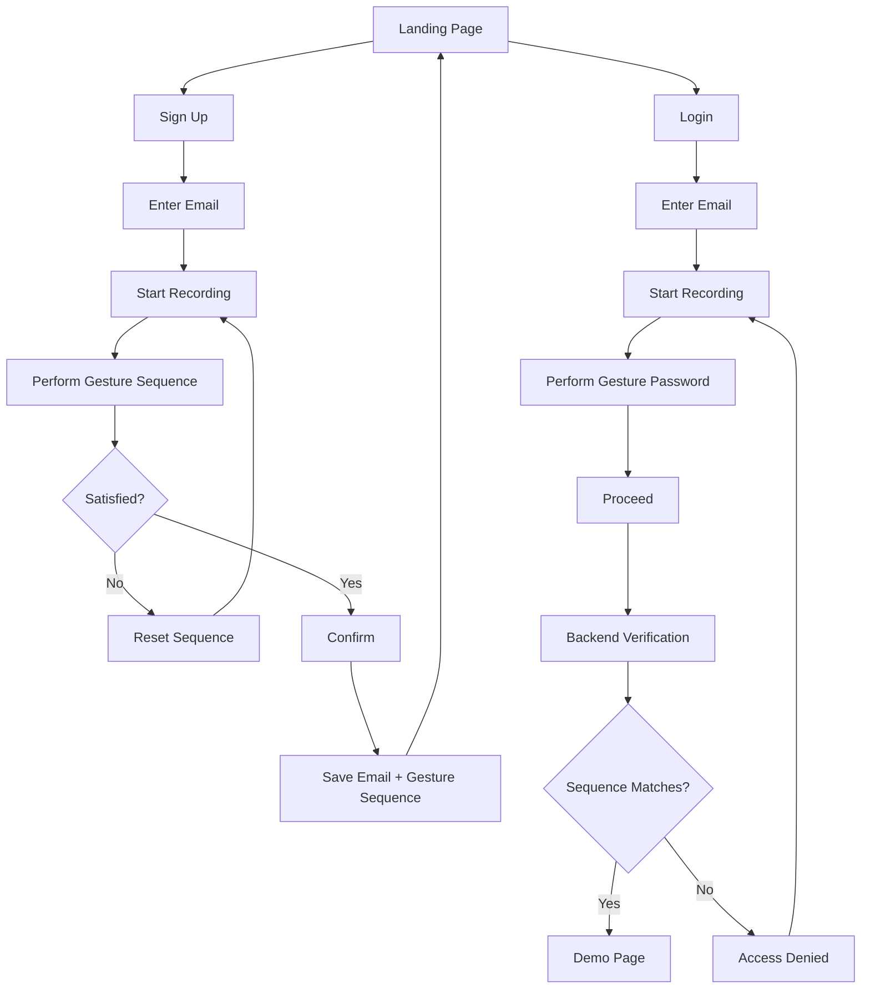
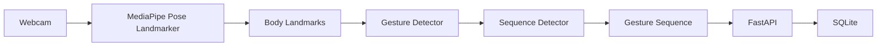

# PassPose


## Basic Details
### Team Name: Solo Kunj


### Team Members
- Member 1: Sneha Elza David - LBS Institute of Technology for Women


# PassPose 🕺

> Your body is the password.

PassPose is a computer vision based passwordless authentication system where your body becomes your password. Instead of typing a traditional password, users create and save a unique sequence of body poses and authenticate by performing the same sequence in front of a webcam.

Because apparently typing a password was too easy. :)

---

## Project Description

PassPose is a fun computer vision based passwordless authentication system that allows users to authenticate themselves using a secret sequence of body gestures.

During sign up, the user enters their email and creates a unique gesture password by performing a sequence of supported poses in front of their webcam. The sequence is detected using MediaPipe and stored in a SQLite database.

During login, the user enters the same email and performs their previously created gesture sequence. The backend compares the recorded sequence with the stored sequence. If they match, access is granted.

So instead of:

> "Enter your password"

PassPose asks:

> "Do your little password dance." :)

---

## The Problem (that doesn't exist)

Traditional authentication relies heavily on text-based passwords. This creates several problems:

- Simple passwords are easy to guess.
- Complex passwords can be difficult to remember.
- Users often reuse passwords across multiple platforms.
- Typing passwords is boring.
- Nobody has ever asked for a password that requires you to squat in front of your webcam.

So we decided to solve the last problem.

---

## The Solution (that nobody asked for)

PassPose replaces traditional text passwords with a **gesture-based password sequence**.

Users create their own secret sequence of body gestures during sign up. The sequence is associated with their email and stored in the database.

Whenever they want to log in, they simply perform the same sequence in front of their webcam.

### No:

- Typing passwords
- Memorizing complicated characters
- Password reuse
- Looking for the Caps Lock key

### Just:

- Stand in front of your webcam
- Perform your secret gestures
- Get authenticated

```text
Your body
   ↓
Your poses
   ↓
Your secret sequence
   ↓
Your password
````

---

# Technical Details

## Technologies / Components Used

### For Software

**Languages:**

* Python
* JavaScript
* HTML
* CSS
* SQL

**Frameworks:**

* FastAPI

**Libraries:**

* MediaPipe
* OpenCV
* Uvicorn
* Pydantic
* SQLite3

**Tools:**

* Git
* GitHub
* Python Virtual Environment
* Browser Web APIs
* MediaPipe Tasks Vision

---

## System Architecture

The main authentication pipeline works as follows:

```text
                    ┌──────────────┐
                    │   Webcam     │
                    └──────┬───────┘
                           │
                           ▼
                  ┌─────────────────┐
                  │    MediaPipe    │
                  │ Pose Landmarker │
                  └────────┬────────┘
                           │
                           ▼
                  ┌─────────────────┐
                  │ Pose Landmarks  │
                  └────────┬────────┘
                           │
                           ▼
                  ┌─────────────────┐
                  │ Gesture Detector│
                  └────────┬────────┘
                           │
                           ▼
                  ┌─────────────────┐
                  │Sequence Detector│
                  └────────┬────────┘
                           │
                           ▼
                  ┌─────────────────┐
                  │    FastAPI      │
                  │     Backend     │
                  └────────┬────────┘
                           │
                           ▼
                  ┌─────────────────┐
                  │     SQLite      │
                  │    Database     │
                  └─────────────────┘
```

---

# Supported Gestures

PassPose currently recognizes the following gestures:

| Gesture          | Description                     |
| ---------------- | ------------------------------- |
| `SQUAT`          | User performs a squat           |
| `LEFT_HAND_UP`   | Left hand is raised             |
| `RIGHT_HAND_UP`  | Right hand is raised            |
| `HANDS_TOGETHER` | Both hands are brought together |
| `ARMS_OUT`       | Both arms are extended outward  |
| `BOTH_HANDS_UP`  | Both hands are raised           |

`NEUTRAL` is treated as a resting state and is not stored as part of the password sequence.

Users can combine the supported gestures in any order to create their own gesture password.

For example:

```text
BOTH_HANDS_UP
      ↓
SQUAT
      ↓
RIGHT_HAND_UP
      ↓
ARMS_OUT
```

The sequence is not hard-coded.

---

# Implementation

## Frontend

The frontend is built using plain:

* HTML
* CSS
* JavaScript

The browser accesses the user's webcam using the browser's camera API.

MediaPipe Pose Landmarker runs in the browser to detect body landmarks from the webcam feed.

The detected landmarks are passed through the gesture detection logic, which identifies the user's current pose.

A sequence detector then converts individual detected gestures into a stable gesture sequence.

---

## Backend

The backend is built using FastAPI.

The backend is responsible for:

* Creating gesture passwords
* Associating gesture passwords with user emails
* Storing gesture sequences
* Retrieving saved gesture sequences
* Verifying login attempts
* Returning authentication results to the frontend

The backend communicates with the SQLite database.

---

## Database

PassPose uses SQLite for local data storage.

The conceptual data structure is:

```text
Users
--------------------------------
id
email
gesture_sequence
```

Example:

```text
id: 1

email:
user@example.com

gesture_sequence:
[
    "BOTH_HANDS_UP",
    "SQUAT",
    "RIGHT_HAND_UP"
]
```

During login, the submitted sequence is compared with the sequence associated with the provided email.

---

# Project Structure

The project is organized approximately as follows:

```text
useless_project_temp/
│
├── index.html
├── README.md
├── requirements.txt
├── .gitignore
│
├── passpose/
│   ├── __init__.py
│   │
│   └── backend/
│       ├── __init__.py
│       ├── main.py
│       ├── camera.py
│       ├── pose_processor.py
│       ├── gesture_detector.py
│       ├── sequence_detector.py
│       ├── password_manager.py
│       ├── auth_service.py
│       ├── auth_controller.py
│       ├── database.py
│       │
│       ├── models/
│       │   └── pose_landmarker_full.task
│       │
│       └── test_*.py
│
└── venv/
```

The final frontend may additionally contain separate pages such as:

```text
signup.html
login.html
demo.html
style.css
script.js
```

depending on the final frontend implementation.

---

# Installation

## 1. Clone the repository

```bash
git clone <your-repository-url>
cd useless_project_temp
```

---

## 2. Create a Python virtual environment

PassPose was developed using Python 3.13.

```bash
py -3.13 -m venv venv
```

Activate the virtual environment on Windows PowerShell:

```powershell
.\venv\Scripts\Activate.ps1
```

---

## 3. Install dependencies

```bash
pip install -r requirements.txt
```

The main dependencies include:

```text
opencv-python
mediapipe
fastapi
uvicorn
```

---

# Run

PassPose consists of a frontend and a FastAPI backend.

## 1. Start the FastAPI backend

From the project root:

```bash
uvicorn passpose.backend.main:app --reload
```

The backend will run at:

```text
http://127.0.0.1:8000
```

---

## 2. Open the API documentation

FastAPI automatically provides interactive API documentation.

Open:

```text
http://127.0.0.1:8000/docs
```

The API includes endpoints for:

```text
POST /password/create
POST /password/verify
```

as well as basic health/root endpoints.

---

## 3. Start the frontend

From the project root, run:

```bash
python -m http.server 5500
```

Then open:

```text
http://localhost:5500
```

in your browser.

Allow webcam access when prompted.

---

# Application Workflow

## Sign Up

A new user follows this flow:

```text
Landing Page
     ↓
   SIGN UP
     ↓
Enter Email
     ↓
Start Recording
     ↓
Perform Secret Gestures
     ↓
Review Gesture Sequence
     ↓
Reset if Necessary
     ↓
Confirm
     ↓
Gesture Password Saved
     ↓
Return to Landing Page
```

---

## Login

A returning user follows this flow:

```text
Landing Page
     ↓
    LOGIN
     ↓
Enter Email
     ↓
Start Recording
     ↓
Perform Previously Created Gesture Password
     ↓
Proceed
     ↓
Backend Verification
     ↓
 ┌───────────────┐
 │               │
MATCH         NO MATCH
 │               │
 ▼               ▼
DEMO PAGE    ACCESS DENIED
```

---

# API Endpoints

## Health Check

```text
GET /
```

Returns a welcome message from the PassPose backend.

---

## Health

```text
GET /health
```

Returns:

```json
{
    "status": "ok"
}
```

---

## Create Password

```text
POST /password/create
```

Creates and stores a gesture password for a user.

Example request:

```json
{
    "email": "user@example.com",
    "sequence": [
        "BOTH_HANDS_UP",
        "SQUAT",
        "RIGHT_HAND_UP"
    ]
}
```

---

## Verify Password

```text
POST /password/verify
```

Verifies a user's email and gesture sequence.

Example request:

```json
{
    "email": "user@example.com",
    "sequence": [
        "BOTH_HANDS_UP",
        "SQUAT",
        "RIGHT_HAND_UP"
    ]
}
```

A successful authentication returns an access-granted response.

An incorrect sequence returns an access-denied response.

---

# Project Documentation

## Screenshots

### 1. Landing Page


*The PassPose landing page where users can choose between Login and Sign Up.*

---

### 2. Sign Up Page


*The Sign Up page where users enter their email and create their secret gesture password using the webcam.*

---

### 3. Login Page


*The Login page where users enter their email and perform their previously created gesture password.*

---

### 4. Demo Page


*The protected demo page displayed after successful authentication.*

> Replace the screenshot paths above with the actual locations of your screenshots if they are stored somewhere else.

---

# Diagrams

## Workflow Diagram



*Workflow of the PassPose authentication system from account creation to login.*

---

# Computer Vision Pipeline



*The computer vision pipeline used to convert webcam movements into a gesture password.*

---

# Project Demo

## Video

[Add your demo video link here]

*The demo shows the complete PassPose workflow, including signing up with a gesture password, returning to the landing page, logging in using the same gesture sequence, and accessing the protected demo page.*

---

## Additional Demos

[Add any additional demo materials, videos, screenshots, or links here.]

---

# Testing

The individual components of PassPose were tested during development.

Tests were created for:

* Webcam access
* Pose detection
* Gesture detection
* Gesture sequence detection
* Password storage
* Password verification
* Database initialization
* Authentication service
* Authentication controller
* FastAPI endpoints

The gesture detector was tested with the following gestures:

```text
SQUAT
LEFT_HAND_UP
RIGHT_HAND_UP
HANDS_TOGETHER
ARMS_OUT
BOTH_HANDS_UP
```

The sequence detector was also tested to ensure that gestures are only added after remaining stable for a number of frames and that `NEUTRAL` does not become part of the password sequence.

---

# Limitations

PassPose is primarily a hackathon project and a demonstration of computer vision based authentication.

It should not be considered a production-grade authentication system.

Some limitations include:

* Gesture recognition depends on webcam quality and lighting.
* Users need to be visible to the webcam.
* Similar body poses may occasionally be classified as the same gesture.
* The current system relies on a predefined set of gestures.
* The gesture sequence itself is not cryptographically secure.
* The system is intended as a fun demonstration rather than a replacement for secure authentication systems.

In other words:

> Please don't use your PassPose dance to protect your bank account. :)

---

# Future Improvements

Possible future improvements include:

* More gesture types
* Better gesture recognition
* Motion-based gestures
* Improved pose classification
* User profile management
* Stronger authentication mechanisms
* Encrypted credential storage
* Animations and additional mascot interactions

---

# Team Contributions

### Sneha Elza David

Basically:

> **Made the entire thing with the help of my AI buddies :)**

---

# Disclaimer

PassPose is a fun experimental project created for the **TinkerHub Useless Projects** hackathon.

The project intentionally explores the idea of making authentication unnecessarily dependent on body movements.

Because sometimes the best solution to a problem is to make the problem much more entertaining.

---

Made with ❤️, caffeine ☕ and questionable decisions at **TinkerHub Useless Projects**


````


